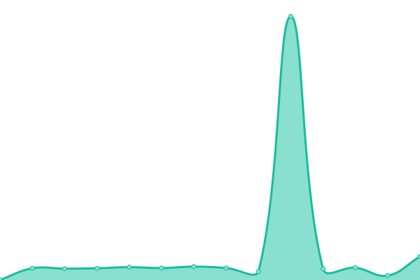
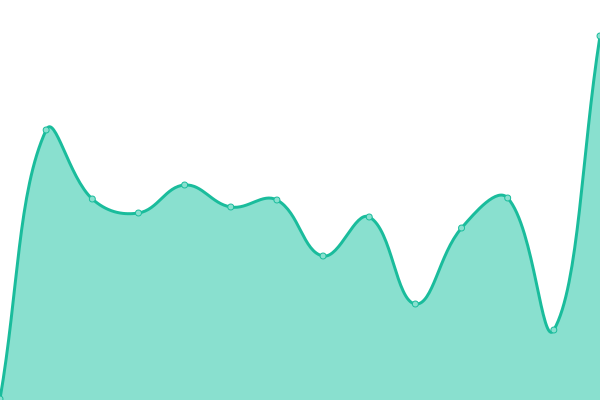
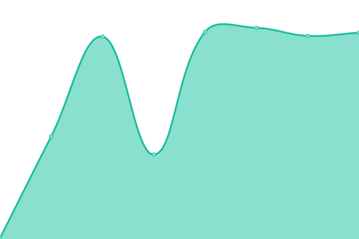

# [📈 Live Status](https://KastelApp.github.io/uptime): <!--live status--> **🟧 Partial outage**

This repository contains the open-source uptime monitor and status page for [Kastel](https://kastelapp.com), powered by [Upptime](https://github.com/upptime/upptime).

With [Upptime](https://upptime.js.org), you can get your own unlimited and free uptime monitor and status page, powered entirely by a GitHub repository. We use [Issues](https://github.com/KastelApp/uptime/issues) as incident reports, [Actions](https://github.com/KastelApp/uptime/actions) as uptime monitors, and [Pages](https://KastelApp.github.io/uptime) for the status page.

<!--start: status pages-->
<!-- This summary is generated by Upptime (https://github.com/upptime/upptime) -->
<!-- Do not edit this manually, your changes will be overwritten -->
<!-- prettier-ignore -->
| URL | Status | History | Response Time | Uptime |
| --- | ------ | ------- | ------------- | ------ |
|  [Canary API](https://canary-api.kastelapp.com) | 🟥 Down | [canary-api.yml](https://github.com/KastelApp/uptime/commits/HEAD/history/canary-api.yml) | 

 215ms
     
 | 

<a href="https://KastelApp.github.io/uptime/history/canary-api">44.23%</a>
    

|  [Canary Gateway](https://dev-gateway.kastelapp.com) | 🟥 Down | [canary-gateway.yml](https://github.com/KastelApp/uptime/commits/HEAD/history/canary-gateway.yml) | 

 193ms
     
 | 

<a href="https://KastelApp.github.io/uptime/history/canary-gateway">44.23%</a>
    

|  [Media Server](https://media.kastelapp.com/ping) | 🟩 Up | [media-server.yml](https://github.com/KastelApp/uptime/commits/HEAD/history/media-server.yml) | 

 220ms
     
 | 

<a href="https://KastelApp.github.io/uptime/history/media-server">49.30%</a>
    

<!--end: status pages-->

[**Visit our status website →**](https://KastelApp.github.io/uptime)

## 📄 License

- Powered by: [Upptime](https://github.com/upptime/upptime)
- Code: [MIT](./LICENSE) © [Anand Chowdhary](https://anandchowdhary.com), supported by [Pabio](https://pabio.com)
- Data in the `./history` directory: [Open Database License](https://opendatacommons.org/licenses/odbl/1-0/)
